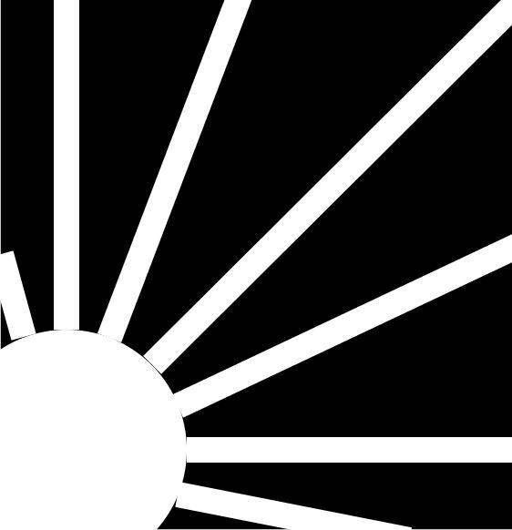
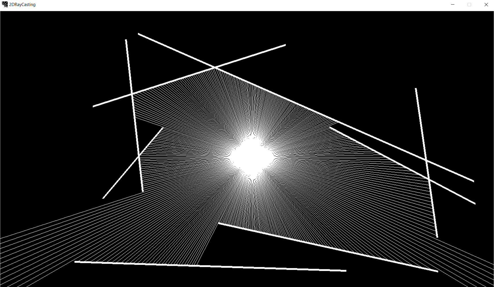
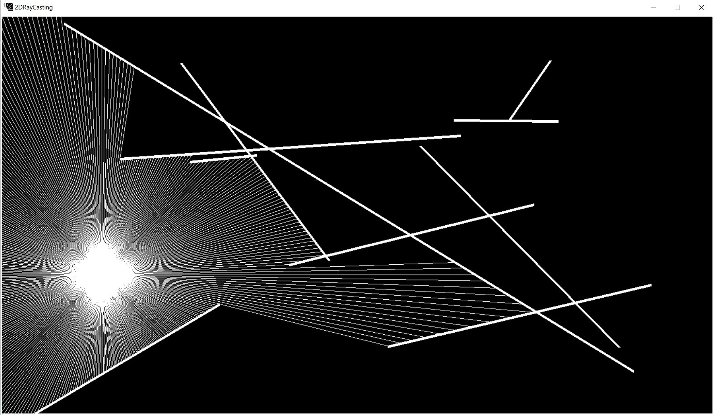

# 2D Ray Casting


2D Ray Casting is a ray visualizer built in python using the pygame library that allows users to move a light source around and cast the appropriate rays onto walls. It was inspired by a video discussing the fundamentals of drawing and casting rays in Javascript (https://www.youtube.com/watch?v=TOEi6T2mtHo). The formula used to check for ray-Wall collisions can be found in the line segment portion of https://en.wikipedia.org/wiki/Line%E2%80%93line_intersection.

## Getting Started

To get started:

1. Run ```pip install -r requirements.txt```
1. Start the application by running ``` python main.py ```

## Usage



The application places a light source, comprised of NUM_RAYS (initially set to 360),  draws 4 border walls, and randomly generates and draws anywhere from 0-10 additional walls. 

The light sources tracks the movement of the mouse and adjusts its rays and collisions accordingly.


Restarting the application generates a new list of Walls, allowing each run to cast rays onto various wall objects.



## Future Iterations
- Add keyboard controls to generate new walls. 
- So far, the Wall, Light, and Ray objects have been created, although more can be added in the future i.e. Mirrors/Transparent surfaces.
